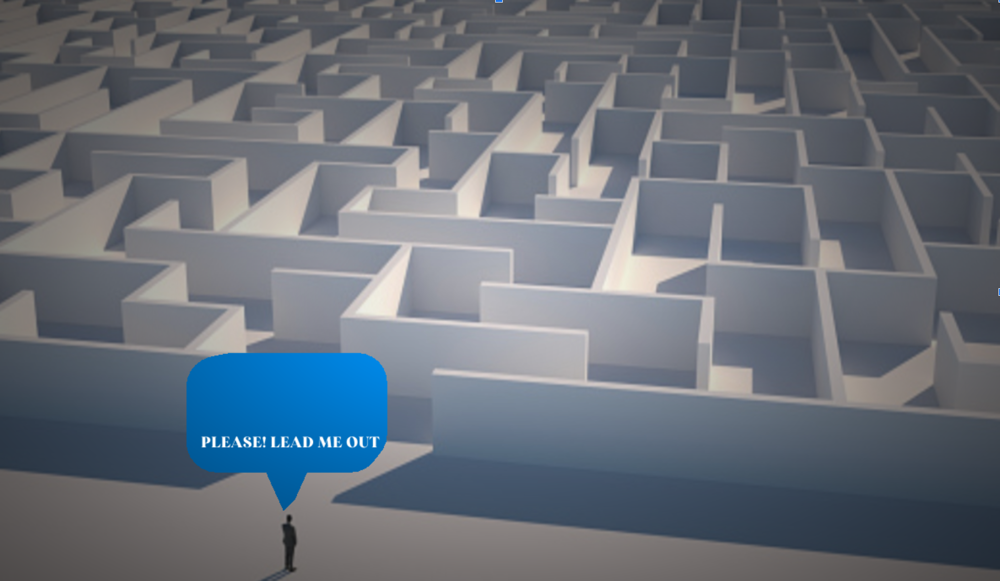
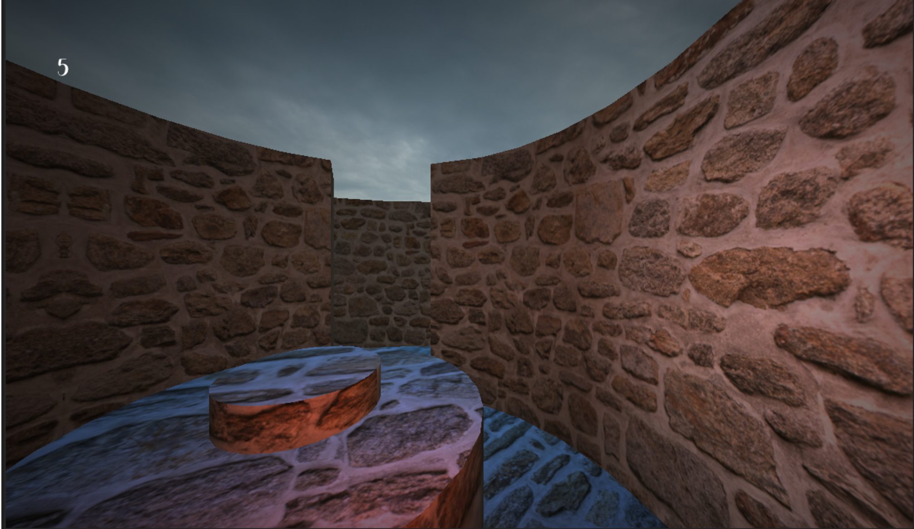
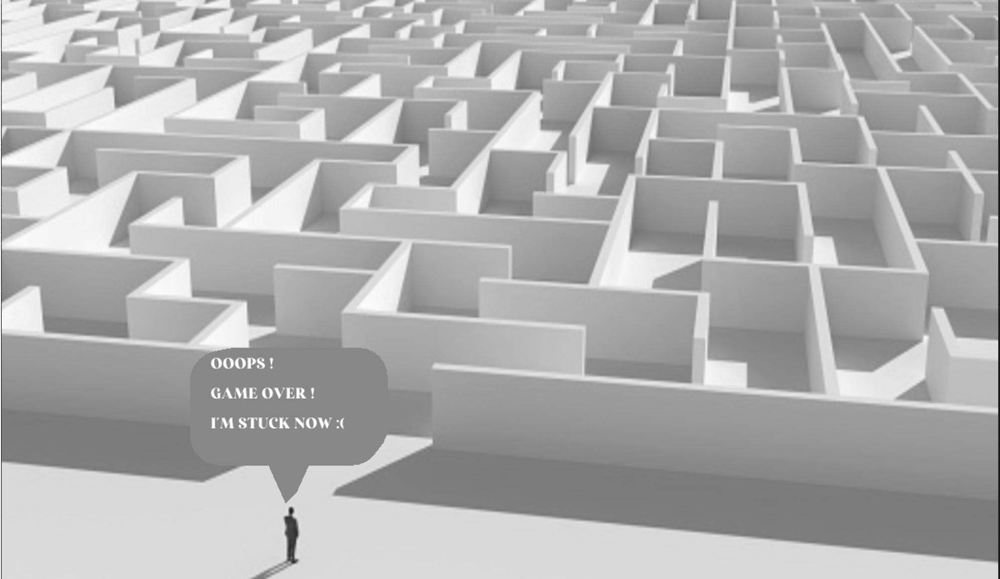
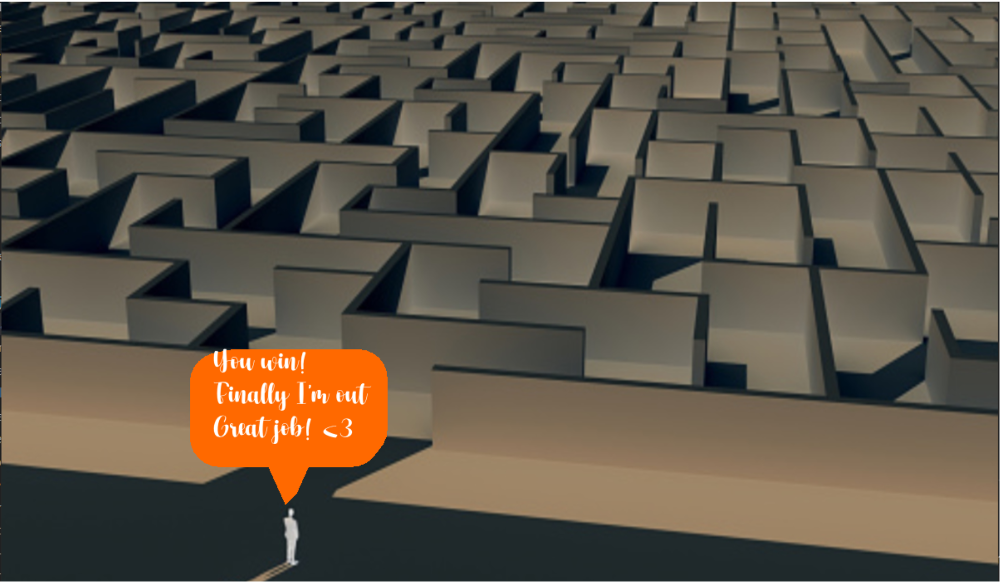

# The Great Escape game 🏃‍♂️

## 📝 Table of Contents

* [About](#about)
* [Getting Started](#start)
* [How to play](#play)
* [Game Demo](#demo)
* [Included Libraries](#IncludedLibraries)
* [Modules](#modules)
* [Future Work](#additions)
* [Contributors](#contributors)


### 📘 About<a name = "about"></a>

* What if the Triwizard Cup was the only way to survive for both Harry and Cedric Diggory with no Voldmort Waiting?
* The Great Escape game is a 3D maze in which your goal is to get out of the maze by reaching the 
trophy before your time ends and die.


## 🏁 Getting Started <a name = "start"></a>

```
Git clone https://github.com/reem-atalah/Graphics-Game-CMP.git
```

```
Git branch checkout Phase2
```

```
Build the project
```

```
Run this Command  .\bin\GAME_APPLICATION.exe -c="config\game\main_menu.jsonc"
```

## 🎮 How to play<a name = "play"></a>


* Press `W` to to move forward 
* Press `S` and backward.
* Press `A` to move left.
* Press `D` to move right.
* Press `Shift` to increase speed.
* Use `Mouse` to rotate.


## 📷 Game Demo<a name = "demo"></a>

* Menu

* Start Scene

* End Scene

* Lose Screen

* Win Screen



## 💻 Included Libraries <a name = "IncludedLibraries"></a>

- [glad 2](https://github.com/Dav1dde/glad/tree/glad2)
- [glfw 3.3](https://github.com/glfw/glfw)
- [glm 0.9.9.8](https://github.com/g-truc/glm)
- [imgui v1.78](https://github.com/ocornut/imgui)
- [flags](https://github.com/sailormoon/flags)
- [json 3.9.1](https://github.com/nlohmann/json)
- [stb](https://github.com/nothings/stb)
- [tinygltf v2.4.0](https://github.com/syoyo/tinygltf)
- [tinyobjloader v1.0.6](https://github.com/tinyobjloader/tinyobjloader)

## 📌 Modules <a name = "modules"></a>

* collision detection system 
* 3d rendering system
* lighting system
* Different Game States

## 📜 Future Work <a name = "additions"></a>

* Adding Sound
* Adding Monsters
* Adding different Game Levels


## Contributors <a name = "contributors"></a>
<table align="center">
  <tr>
    <td align="center">
    <a href="https://github.com/reem-atalah" target="_black">
    
    <br />
    <sub><b>Reem Emad</b></sub></a>
    </td>
    <td align="center">
    <a href="https://github.com/NouranHany" target="_black">
    
    <br />
    <sub><b>Noran Hany</b></sub></a>
    </td>
     <td align="center">
    <a href="https://github.com/Raghad-Khaled" target="_black">
    
    <br />
    <sub><b>Raghad Khaled</b></sub></a>
    </td>
     <td align="center">
    <a href="https://github.com/Halahamdy22" target="_black">
    
    <br />
    <sub><b>Hala Hamdy</b></sub></a>
    </td>
  </tr>
 </table>
